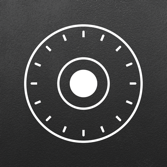
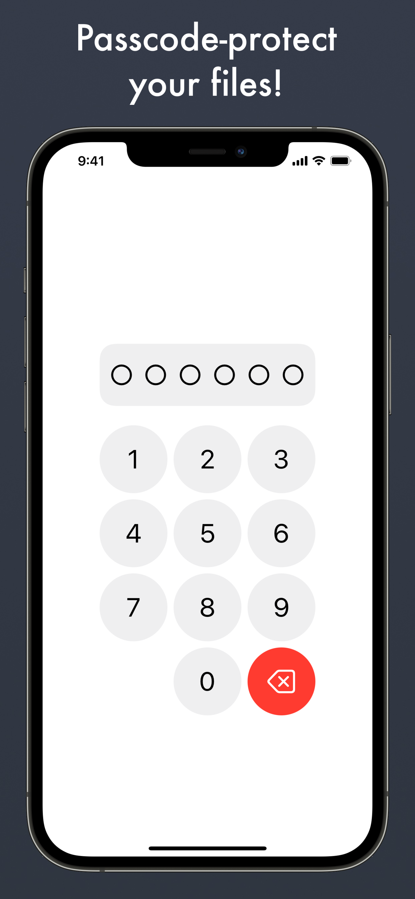
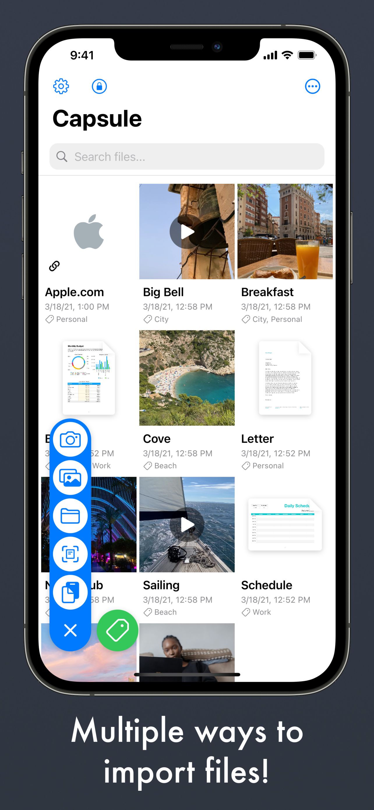
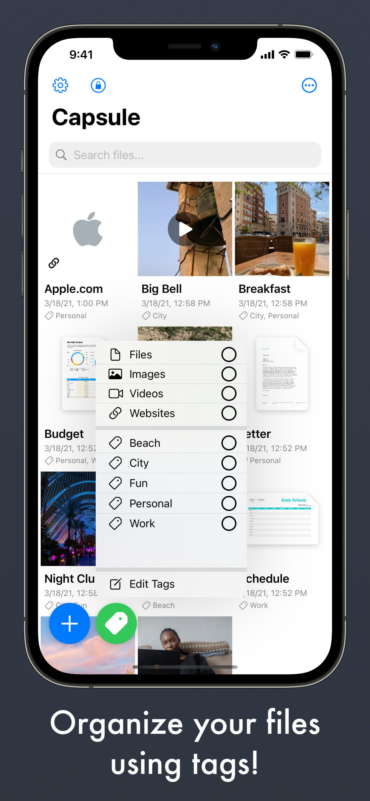
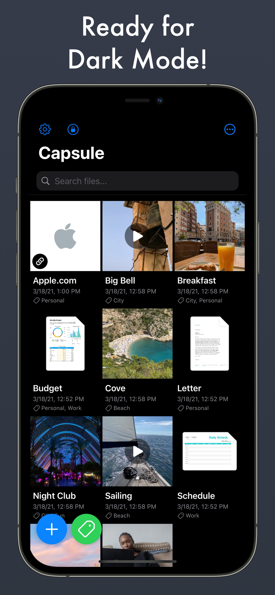

# Capsule Private Storage

Keep your files away from prying eyes!

Capsule is a completely free app that lets you store files and media behind a passcode.

It was created by Emilio Peláez, Danny Behar and Ian Manor for the 2021 SwiftUI Jam Hackathon.

<p float="left">
  
  
  
  
</p>

## Features:
Easily import your files in multiple ways, use the photo or file pickers, drag them from another app (iPadOS), copy them from the clipboard, or take a photo with the camera.

Use tags to sort and filter your files.

Unlock with FaceID or TouchID for instant access.

## Building the code

1. Install the latest [Xcode developer tools](https://developer.apple.com/xcode/downloads/) from Apple.
1. Clone the repository:
    ```shell
    git clone https://github.com/EmilioPelaez/CapsulePrivateStorage/
    ```
1. Open the `PrivateVault.xcodeproj` file in Xcode.
1. Build the `PrivateVault` scheme.

Make sure to run on a physical device if you want to have access to all the features. 

## Contributing

If you want to contribute, create your own fork of the repository so you can open Pull Requests.

## License

Capsule is available under the MIT license. See the LICENSE file for more info.
