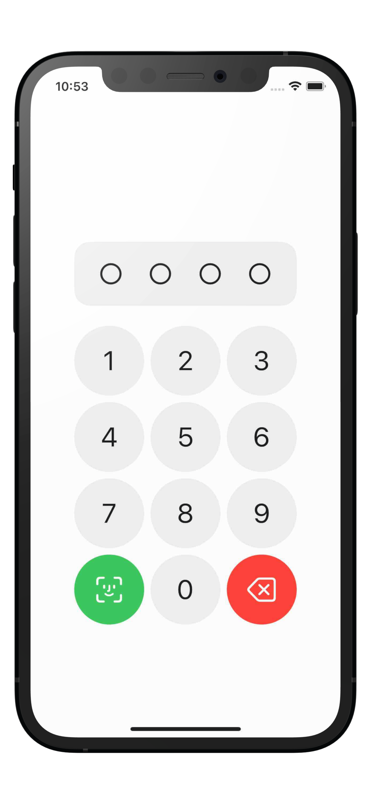
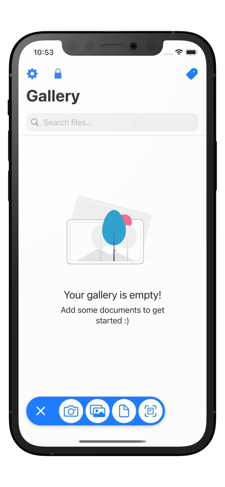
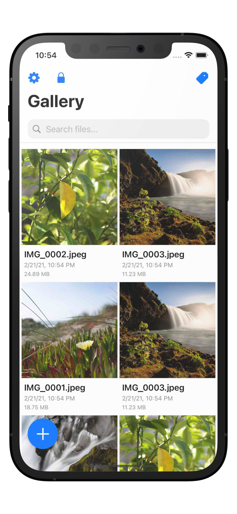
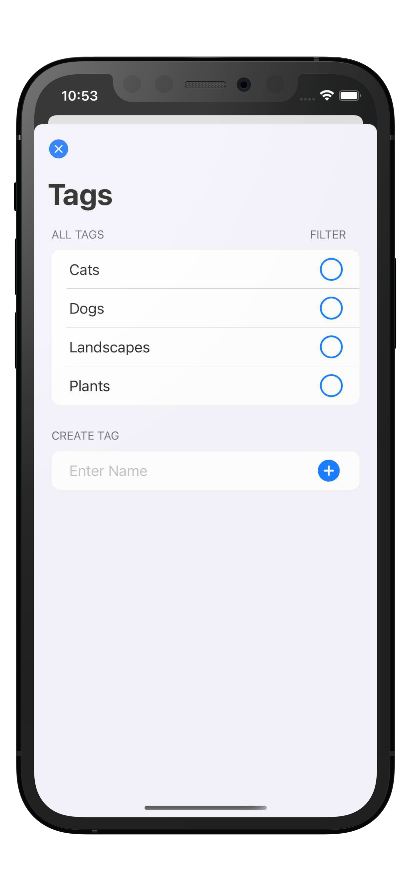

# PrivateVault

PrivateVault is an iPhone and iPad app for securely storing private user data. It was created by Emilio Peláez, Danny Behar and Ian Manor for the 2021 SwiftUI Jam Hackathon.

## Screenshots

<p float="left">
  
  
  
  
</p>

## Features:
- [x] PIN-style passcode protection
- [x] File gallery
- [x] File search 
- [x] Tags
- [x] iPad drag-and-drop
- [x] Import files and photos from device
- [x] Built-in camera
- [x] Document scanner
- [x] Touch ID 
- [x] Face ID

## Building the code

1. Install the latest [Xcode developer tools](https://developer.apple.com/xcode/downloads/) from Apple.
1. Clone the repository:
    ```shell
    git clone https://github.com/EmilioPelaez/PrivateVault/
    ```
1. Open the `PrivateVault.xcodeproj` file in Xcode.
1. Build the `PrivateVault` scheme.

Make sure to run on a physical device if you want to have access to all the features. 

## Contributing

If you want to contribute, create your own fork of the repository so you can open Pull Requests.

## License

PrivateVault is available under the MIT license. See the LICENSE file for more info.
